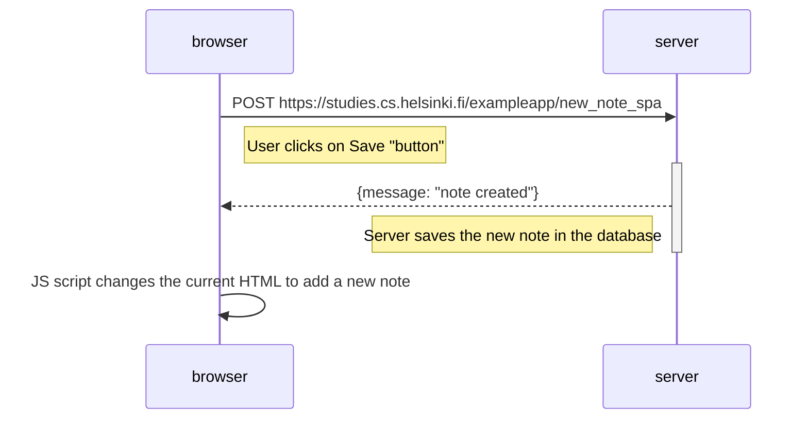

```mermaid
sequenceDiagram
    participant browser
    participant server

    browser->>server: POST https://studies.cs.helsinki.fi/exampleapp/new_note_spa

    Note right of browser: User clicks on Save "button"
    activate server
    server-->>browser: {message: "note created"}
    Note left of server: Server saves the new note in the database

    deactivate server

    browser->>browser: JS script changes the current HTML to add a new note;
```